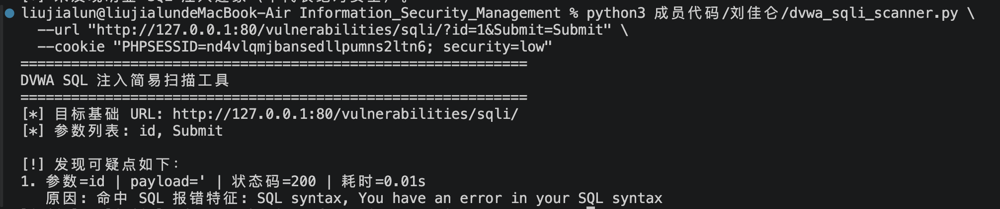

# DVWA SQL 注入简易扫描工具说明
刘佳仑——2023211559
## 1. 工具定位
这是一个简单的 SQL 注入扫描脚本，目标是：
- 快速检测 DVWA 页面参数是否存在 SQL 注入可疑迹象
- 输出可疑参数、payload 和触发原因

## 2. 文件说明
- `dvwa_sqli_scanner.py`：扫描脚本（Python 3）

## 3. 安全与授权说明
本工具只用于本地 DVWA 靶场、课程实验环境或已获得明确授权的测试目标。
不要将它用于未授权的网站或生产系统，否则可能造成异常请求、日志告警或法律风险。

使用时还需要注意：
- Cookie 中可能包含登录会话信息，不要把真实 Cookie 提交到公开仓库或截图中。
- 扫描结果只是“可疑迹象”，不能直接等同于漏洞结论。
- 发现可疑点后，应结合页面回显、请求参数、后端代码或手工复测进行确认。

## 4. 扫描逻辑
脚本会先发一个“基线请求”，再对每个 GET 参数拼接 payload 做对比，核心规则有 3 条：

1) SQL 报错特征匹配
- 检查响应中是否出现典型数据库报错文本
- 比如 `You have an error in your SQL syntax`、`PDOException` 等

2) 响应长度异常变化
- 如果测试响应和基线响应长度差异很大，就标记可疑
- 这是一个粗粒度规则，适合快速筛查

3) 延时注入迹象
- 对 `SLEEP` 类 payload 做简单耗时判断
- 如果明显慢于基线，则提示疑似时间盲注

## 5. 使用前准备（DVWA）
1. 启动 DVWA
2. 登录 DVWA
3. 将 Security Level 设置为 `Low`
4. 复制浏览器中的 Cookie（至少包含 `PHPSESSID` 和 `security`）

Cookie 示例：
PHPSESSID=abc123; security=low

## 6. 运行示例
在当前目录执行：

python3 dvwa_sqli_scanner.py \
  --url "http://127.0.0.1:8080/vulnerabilities/sqli/?id=1&Submit=Submit" \
  --cookie "PHPSESSID=abc123; security=low"

可选参数：
- `--timeout`：请求超时，默认 8 秒

## 7. 输出结果说明

- 目标页面：`/vulnerabilities/sqli/`
- 被测参数：`id`
- 命中 payload：例如 `' OR '1'='1`
- 工具输出原因：例如“命中 SQL 报错特征”或“响应长度变化较大”
- 人工复核：在浏览器手工构造请求，观察页面行为是否一致

### 运行结果示例
进行了简单的代码运行测试，运行结果如下：

## 8. 人工复核建议
如果工具提示某个参数可疑，可以按下面步骤复核：

1. 在浏览器或 Burp Suite 中重放同一个请求。
2. 分别发送正常参数、单引号参数、布尔条件参数和 `SLEEP` 类参数。
3. 对比页面内容、HTTP 状态码、响应长度和响应时间。
4. 如果能稳定复现报错回显、真假条件差异或明显延迟，再记录为 SQL 注入风险。

## 9. 局限性
- 只做 GET 参数扫描
- 未处理 POST、JSON、复杂认证流程
- 规则是启发式的，存在误报/漏报
